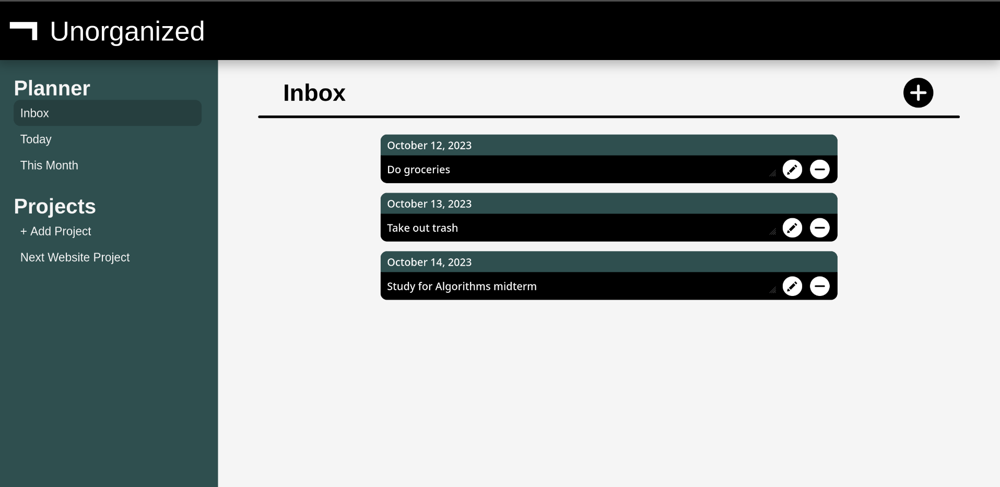

# Not Unorganized : OdinProject Restaurant Page Project

**Note:** The website is not mobile responsive, need some icons in sidebar, could add settings section where user can customize colors, disallow adding tasks from pior date and change color of overdue tasks. These may be an improvements done in the future, however it is not certain.

This website was made for the OdinProject's Todo List assignment. The assignment's purpose was to make apply SOLID Principles.

## Live Demo:
[Not Unorganized](https://naetsawd.github.io/OdinProject-ToDoList)

## About Website:
At first glance it doesn't make sense that a todo list website is called "Unorganized". However, the icon next to the name is the logical negation which is read as "not" hence the name is actually "Not Unorganized". The tasks in the Today and This Month sections are taken from the Inbox so the user can view urgent tasks. Projects can be added and removed to the user's liking and their respective stored tasks will be removed from the local storage. All tasks and lists are stored using the browser's inbuilt local storage.

## Made Using:
- JavaScript
- HTML5
- CSS3
- Node.js
- Webpack and Other Node.js Modules)